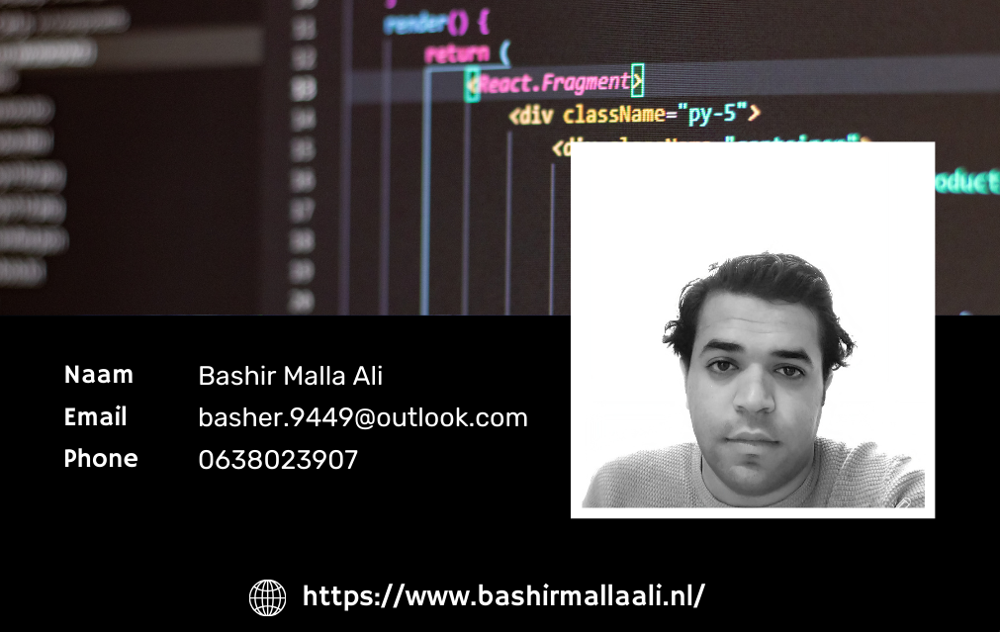

<html lang="en">
<head>
  <meta charset="utf-8">
  <meta name="viewport" content="width=device-width, initial-scale=1">
  <meta name="description" content="">
  <meta name="author" content="Bashir Malla Ali">

  <!-- CSS FILES -->

  <link href="css/mijn-style.css](https://cdn.jsdelivr.net/npm/bootstrap@5.3.2/dist/css/bootstrap.min.css" rel="stylesheet">

</head>

<body>

<h1 style="color: red; text-align: center;">Portfolio</h1>

<h3>Ontwikkeld door   Bashir Malla Ali </h3>

  

<li>Portfolio</li>
<ul>
<li>Webgame</li>
<li>Irritante webpagina</li>
<li>Web shop</li>
<li>Form-laravel</li>
<li>TODO-APP</li>
<li>React</li>
<li>Websocket</li>

</ul>

</body>
</html>
